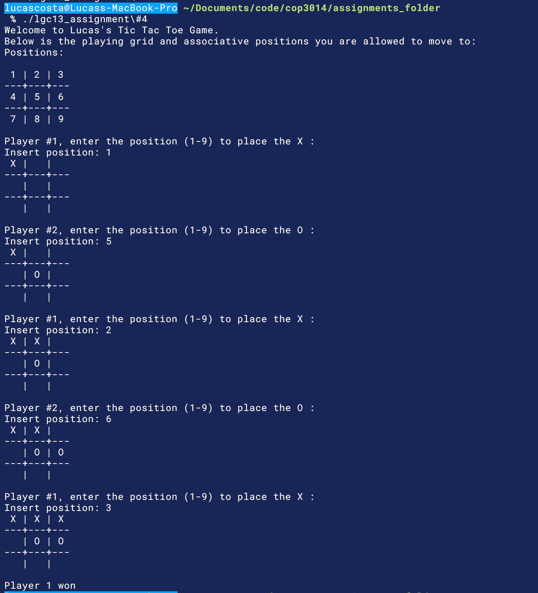
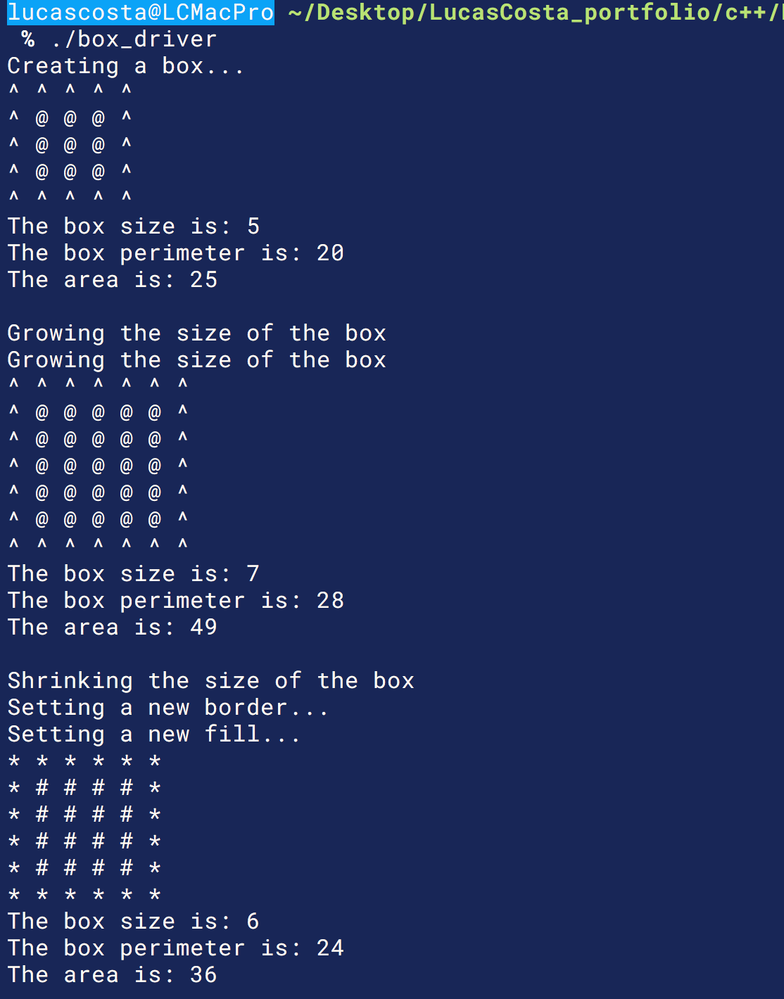

<!-- Technology logo picture and title -->
<h1>C++ projects</h1>

<!-- Technology welcome message -->
The majority of the projects and practice problems in this repo directory have great foundation concepts, that teach all the basic to intermediate skills that any programmer must have. For example: data types, creating and calling functions, mathematical equations, loops, classes, constructors, among others.

C++ was the first official programming language that I ever learned. I was taught it during my sophomore year at Florida State University. Aside from all programming basic skills, I also learned how to critically think in order to solve problems, and create algorithms.

<h6>Click the title links if you want to see more details about a particular project.</h6>


<h2><a href="https://github.com/lgc13/LucasCosta_portfolio/tree/master/c%2B%2B/TicTacToe_project">1- Tic Tac Toe Game App </a></h2>

<!-- Project BIO -->
Tic Tac Toe is a really fun and easy game to play. I created this console app which can be played by 2 people on the same console. I created a few functions that could easily be reused when needed, as I had not learned of object oriented programming yet. This application displays some of my skills with:

- code reusability (a single board layout was used)
- user input validation  
- game win condition validation
- loops through arrays
- function calls



<!--  -->

<!-- Code explanation -->
I used a single function to create the playing board whenever it was necessary. By passing in an array with the current values of each index, I could print out a centered board with "walls" such as ---+---+--- and |. I iterated through the board length with a for loop, using setw to adjust the width location of every input value, even if that were a blank character.

<!-- Code snippet -->
You can see that in this code snippet:

```c++

void PrintBoard(char Board[9])
{
  for (int i = 0; i < 9; i++){
      //center numbers and display them from Board array.
      int len = 0;
      string word;
      len = word.length();
      len = ((4 - len) / 2) + len;
      cout << setw(len) << Board[i]; // print value from given Board Array

      // Go to next line and add --+---+---
      if ((i+1)%3 == 0){
        cout << endl;
        if ((i+1) != 9){
          cout << "---+---+---" << endl;
        }
        else {
          cout << endl;
        }
      }
      //Add a |
      else if ((i+1)%3 != 0){
        cout << " |";
      }
  }
}

```

<h2><a href="https://github.com/lgc13/LucasCosta_portfolio/tree/master/c%2B%2B/Box_Constructors_project">
2- Box Constructors App</a></h2>

<!-- Project BIO -->
"Small paragraph talking about what this project does with any particular key terms used to accomplish it"


<!--  -->

<!-- Code explanation -->
"BRIEF TALK ABOUT THE FOLLOWING CODE SNIPPET:"

<!-- Code snippet -->
```c++

cout << "test" << endl;

```

<h2><a href="https://github.com/lgc13/LucasCosta_portfolio/tree/master/c%2B%2B/MultiFunctionCalculator_project">
3- Multi Function Calculator App</a></h2>

<!-- Project BIO -->
"Small paragraph talking about what this project does with any particular key terms used to accomplish it"


<!--  -->

<!-- Code explanation -->
"BRIEF TALK ABOUT THE FOLLOWING CODE SNIPPET:"

<!-- Code snippet -->
```c++

cout << "test" << endl;

```


<!-- Practice section -->
# Practice:

Although these were my biggest projects with C++, I have worked on quite a lot more smaller projects, practice problems and trivia questions. You can see these by clicking this link:

[Practice Directory](https://github.com/lgc13/LucasCosta_portfolio/tree/master/c%2B%2B/practice)

<hr>
- Reminder to self:

To compile and build c++ files, use the following cmd:

```c++
g++ file_name.cpp -o file_name
```

If there are more files (classes) that are linked to this, do the following:

```c++
g++ file_name.cpp file_class.cpp file_class2.cpp -o file_name
```

Further instructions can be found here:
[Link](https://www.dvc.edu/academics/departments/computer-science/pdfs/UsingAppleXCode.pdf)

<!-- Contact info -->
# Let's Connect! Don't be shy...

Do you like what you see? Here are some other pages where you can get some more info, and/or connect with me!

<a href="mailto:lucas.gomes.costa@gmail.com"></a> Email: lucas.gomes.costa@gmail.com

<a href="https://www.linkedin.com/in/lucas-gomes-costa/"> </a> LinkedIn: <a href="https://www.linkedin.com/in/lucas-gomes-costa/">  https://www.linkedin.com/in/lucas-gomes-costa/ </a>

<a href="https://lgc13.wordpress.com/"></a> Wordpress: <a href="https://lgc13.wordpress.com/">  https://lgc13.wordpress.com/ </a>
